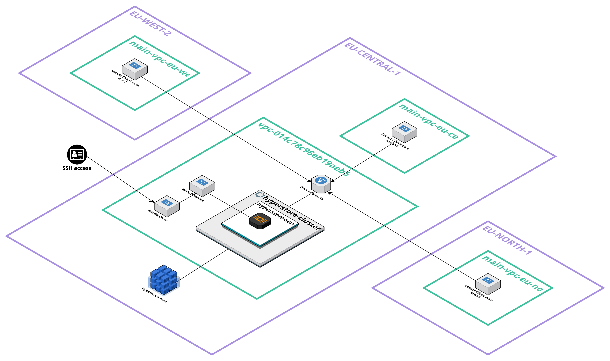
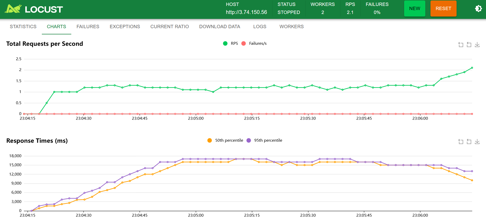

# Hyperstore

This is a virtual store that only exists to test scalability & IaC based on Laravel, AWS and Terraform.

Motivation is to have a fully IaC system that supports 1000 concurrent users in a realistic setup (multiple clients spread across regions). The goal is also to identify real-world costs of such an environment and toa chieve decent response times for read & write operations.

# Architecture

Essentially the system design looks like this

So there are three client machines in separate regions. The main backend is based on ECS/Fargate with a Redis database. All traffic is terminated at the respective Network Load Balancer.

## Setup

This project is based on Laravel. To get started do a 

    sudo apt install php php-xml php-curl php-redis php-sqlite3
    sudo apt install composer

Make sure that PHP fileinfo and Redis extension are enabled in `php.ini`:

    extension=fileinfo
    extension=php_redis.dll

To setup the project do

    composer install
    composer create-project laravel/laravel hyperstore-api

This will take a while and shall give you a subdirectory hyperstore-api. Now do this to start the service:

    cd hyperstore-api
    php artisan key:generate
    php artisan serve

## PHP

For some of the advanced features you should use PHP 8.3.x. This is not the default on Ubuntu, therefore do

    sudo add-apt-repository ppa:ondrej/php
    sudo apt update
    sudo apt upgrade
    sudo apt install php-redis php-sqlite3

Check PHP version via

    php --version

## Code

The controller was initiated via

    php artisan make:controller HyperController

But just check the codebase.

## Debug

To use Laravel Debugbar just run

    composer require barryvdh/laravel-debugbar --dev

and set

    APP_DEBUG=true

in `.env`. Also activate the middleware so this also works for JSON in `app/Http/Middleware/Kernel.php`:

    \App\Http\Middleware\AppendDebugbar::class

However the inisghts gained by Debugbar seem limited to me. There is more with Telescope but this requires an SQLite database. Install one via

    sudo apt install sqlite3
    sudo apt install php-sqlite3

On Windows you need to enable

    extension=pdo_sqlite
    extension=sqlite3

in `php.ini`.

And afterwards install telescope for local environment via

    composer require laravel/telescope --dev
    php artisan telescope:install
    php artisan migrate 

Telescope should be available at http://127.0.0.1/telescope then.

## Docker image

Before creation make sure to clear everything (see https://stackoverflow.com/a/61953327/675454, https://stackoverflow.com/a/55474102/675454):

    # TODO: add comment to clear laravel.log 
    php artisan config:clear
    php artisan cache:clear
    php artisan route:clear
    php artisan optimize:clear
    composer dump-autoload --optimize
    # Cache config
    php artisan config:cache
    # Cache routes
    php artisan route:cache

The `Dockerfile`is prepared and an image can be created via

    docker build -t hyperstore .

Run this through

    docker run -p 80:80 --network="host" --name hyperstore hyperstore

The "host" parameter is needed in case you want to access the locally running Redis DB.

Trace logs via

    docker exec -it hyperstore tail -f storage/logs/laravel.log
    docker exec -it hyperstore tail -f /var/log/nginx/access.log
    docker exec -it hyperstore tail -f /var/log/nginx/error.log

Check the enabled routes

    docker exec -it hyperstore php artisan route:list

SSH into the container

     docker exec -it hyperstore sh

## Prepare AWS

    sudo apt install awscli
    aws configure

    # Login to ECR to store Docker image
    aws ecr get-login-password --region eu-central-1 | docker login --username AWS --password-stdin 290562283841.dkr.ecr.eu-central-1.amazonaws.com

    # Create repo
    aws ecr create-repository --repository-name hyperstore-repo --region eu-central-1

    # Tag local image
    docker tag hyperstore:latest 290562283841.dkr.ecr.eu-central-1.amazonaws.com/hyperstore-repo:latest

    # Push image
    docker push 290562283841.dkr.ecr.eu-central-1.amazonaws.com/hyperstore-repo:latest

    # Check that image is actually there
    aws ecr list-images --repository-name hyperstore-repo --region eu-central-1

    # Re-deploy the service with a new image uploaded to ECR
    aws ecs update-service --cluster hyperstore-cluster --service hyperstore-service --force-new-deployment

## IaC

First install Terraform following the [instructions](https://developer.hashicorp.com/terraform/tutorials/aws-get-started/install-cli). 

Terraform needs aws credentials. The best way to set this up is via AWS CLI.

    brew install awscli

Then do

    terraform init
    terraform apply

To teardown everything

    terraform destroy

ECS task execution is enabled so if you need to SSH into the container do

    aws ecs execute-command --cluster hyperstore-cluster --task b12aef02a7a84346bff48ab6487a4ef7 --container hyperstore-app --interactive --command "/bin/bash"

Unfortunately this only worked sometimes, reason unclear.

The terraform code does a lot, summarized briefly:

- setup ECS and deploy recent "hyperstore" container from ECR and VPC + subnets needed
- create Redis DB as EC2 instacne and jumphost for local access
- setup AWS parameter store with mandatory runtime variables for ECS container
- setup Cloudwatch
- setup Network Load Balancer since ECS container and Redis are only in private network
- set CNAME of domain hyperstore.cc after NLB was created (DNS changes every time)

All sensible data is in terraform.tfvars file, this would be (region-specific)

    cloudflare_email = "X"
    cloudflare_api_key = "Y"
    cloudflare_zone_id = "Z"

## Database

We use Redis both for logging activity and the actual "data" that is being processed. For now we
use an EC2-based Redis DB. The issue here is that an Elastic IP is defined here that shall
not change since this would affect the logic, therefore it was removed from terraform handling via

    terraform state rm aws_eip.redis_hyperstore_eip

### Localhost

For local development it is easiest to just install Redis via Linux/WSL

    sudo apt-get install redis-server
    sudo service redis-server start

    # Test via
    redis-cli
    ping

### Database

For now there is just a single DB instance in eu-central-1 that covers all global services. Also a local one can be used for simple testing/debugging, see above.

There is no Public IP or SSH for the Redis instance in the backend, therefore a Bastion host is created automatically. This was tested and works using Redis Isght, just refer to Bastion host IP and private key and connect shall work for all Redis DB interactions. The necessary key is created during each run in

    /terraform/server/eu-central-1/bastion-key.pem

### Client

The clients use [locust](https://locust.io/) as test framework. 

#### Local testing

To generate load from local machine just create the `locustfile.py` and install locust as follows

    pip3 install locust

Start this then via

    locust -f locustfile.py --host=https://hyperstore.cc

and open browser at http://localhost:8089.

#### Testing with multiple clients in the Cloud

Locust is pre-installed on the AMI-based VMs (EC2 Nano instance). Essentially this is just an Ubuntu LTS machine. Make sure to enable SSM by defining a role (e.g. hyperstore-ssm). Otherwise this is the setup after boot:

    sudo apt-get update
    sudo apt-get upgrade
    sudo apt-get install python3-pip
    sudo pip3 install locust --break-system-packages --ignore-installed
    sudo pip3 install python-dotenv --break-system-packages

    # Get current benchmark file
    wget https://raw.githubusercontent.com/janpetzold/hyperstore/refs/heads/main/terraform/client/locustfile.py -O /home/ubuntu/locustfile.py
    
    # Then assign proper AMI role AmazonSSMManagedInstanceCore and restart service
    sudo systemctl restart snap.amazon-ssm-agent.amazon-ssm-agent.service

I also tried `user_data` scripts but this was pretty unreliable so I went with AMIs.

Amazon SSM agent was available out of the box using the AWS Ubuntu image:

    sudo systemctl status snap.amazon-ssm-agent.amazon-ssm-agent.service

The AMI is zone-specific so it needs to be copied to all the regions/zones we care about:

    # Source Frankfurt, Target Stockholm
    aws ec2 copy-image --source-image-id ami-0d3276b7bee963d0b --source-region eu-central-1 --region eu-north-1 --name "Hyperstore Locust Client" --description "Locust client AMI for benchmarking Hyperstore for eu-north-1"
    # Source Frankfurt, Target London
    aws ec2 copy-image --source-image-id ami-0d3276b7bee963d0b --source-region eu-central-1 --region eu-west-2 --name "Hyperstore Locust Client" --description "Locust client AMI for benchmarking Hyperstore for eu-west-2"

For now the AMI IDs were as follows

    eu-central-1: ami-0d3276b7bee963d0b
    eu-north-1: ami-08535198e6033a45a
    eu-west-2: ami-04b4db0aa8f2c5c7a

If you launch these clients via `terraform apply` the instance ID shall be printed to the command-line.

To run the "default" load test just the host needs to be supplied via AWS SSM like this:

    # Frankfurt node as master 
    aws ssm send-command --region eu-central-1 --document-name "AWS-RunShellScript" --targets "Key=instanceids,Values=i-0bfdf59b0a98dc83d" --parameters 'commands=["cd /home/ubuntu", "locust --master"]'

    # Stockholm is worker #1
    aws ssm send-command --region eu-north-1 --document-name "AWS-RunShellScript" --targets "Key=instanceids,Values=i-0a57efcaac1fb5c80" --parameters 'commands=["cd /home/ubuntu", "locust --worker --master-host=3.125.4.94"]'

    # London is worker #2
    aws ssm send-command --region eu-west-2 --document-name "AWS-RunShellScript" --targets "Key=instanceids,Values=i-07c16871063269aae" --parameters 'commands=["cd /home/ubuntu", "locust --worker --master-host=3.125.4.94"]'

Check execution at

https://eu-central-1.console.aws.amazon.com/systems-manager/run-command

#### Master / Slave and UI

By default Locust offers a UI at port 8089 but we don't need to open this one since it would be publically available. Instead fo this we forward the port to our local machine:

    aws ssm start-session --target i-0bfdf59b0a98dc83d --document-name AWS-StartPortForwardingSession --parameters '{"portNumber":["8089"],"localPortNumber":["8089"]}'

and can open the UI then via

http://localhost:8089

In there you can set up the actual load test parameters (number of users, spawn rate, duration etc.). You will end up with something like this

#### Load test update

Now it may be desired to replace the default load script with a custom one. See `locustfile.py` on what is currently used. To replace that without opening another port SSM can also be used, it is not very elegant but essentially we encode the file to Base64 here and "upload" it via echo command which works reliably (at least when file is in kByte range).

The same has to be done to .env file which contains the OAuth credentials and is needed so that the client can access the APIs.

    # Run this in the directory of locustfile.py
    base64_env=$(base64 -w 0 .env)
    base64_loadtest=$(base64 -w 0 locustfile.py)

    # eu-central-1
    aws ssm send-command --region eu-central-1 --instance-ids "i-0bfdf59b0a98dc83d" --document-name "AWS-RunShellScript" --parameters "commands=[\"echo '$base64_loadtest' | base64 -d > /home/ubuntu/locustfile.py\"]"  --output text
    aws ssm send-command --region eu-central-1 --instance-ids "i-0bfdf59b0a98dc83d" --document-name "AWS-RunShellScript" --parameters "commands=[\"echo '$base64_env' | base64 -d > /home/ubuntu/.env\"]"  --output text

Make sure to execute this in the directory where `locustfile.py` is.

#### Sync workers via artisan

To simplify provisioning all workers (currently 12 EC2 instances) with the load test and credentials an artisan task was created. 

    composer create-project laravel/laravel worker-sync
    composer remove laravel/sanctum laravel/tinker laravel/ui fakerphp/faker laravel/pail laravel/pint laravel/sail mockery/mockery nunomaduro/collision phpunit/phpunit
    composer require aws/aws-sdk-php

To run this just do
    cd ../worker-sync
    php artisan app:sync-hyperstore-load-test-to-workers

#### Run master and workers via artisan

If provisioning is complete start the entire client setup via

    php artisan app:start-master-and-workers

The load test can also be started from master node via

    locust -f locustfile.py --headless --master --expect-workers 11 -u 1000 -r 1 --run-time 10m --host https://hyperstore.cc

## Debugging

Prepare debugging via

    pecl install xdebug

Also/alternatively check the guidelines from https://xdebug.org/wizard

I had a .vscode/launch.json with the following content:

    {
        "version": "0.2.0",
        "configurations": [
        {
            "name": "Listen for Xdebug",
                "type": "php",
            "request": "launch",
            "port": 9003
        }
        ]
    }

And I needed to update php.ini for debugging to work (place this right at the beginning):

    xdebug.mode = debug
    xdebug.start_with_request = yes
    xdebug.client_port = 9003
    xdebug.client_host = "127.0.0.1"

Then just start "Listen for XDebug" in VSCode Run & Debug menu. Install the PHPUnit and PHP Debug extensions beforehand.

## Octane

To speed up the server [Octane](https://laravel.com/docs/11.x/octane#) is used with the [FrankenPHP](https://frankenphp.dev/) server. The impact is quite massive, especially subsequent requests to the same endpoint get a response in less than 50ms (including Redis query) on Fargate (~100ms for local development on Docker or Ubuntu) compared to 400ms for the same request using unoptimized `php artisan serve`.

FrankenPHP only works on Mac or Linux, so on Windows you have to use WSL. Setup via

    composer require laravel/octane
    php artisan octane:install

Create a `Caddyfile` and you can serve the application just like this

    php artisan octane:start --server=frankenphp

For the Docker image the base of [dunglas/frankenphp](https://hub.docker.com/r/dunglas/frankenphp) was used.

## Domain

The domain hyperstore.cc was configured in Cloudflare with he following settings:

- CNAME mapped to AWS NLB DNS
- SSL Mode is "Flexible"
- SSL Edge Certificates set to "Always use HTTPS"

Also I added a WAF rule to block http traffic (field SSL/HTTPS to "off" and then block).

# OAuth2

Based on recent recommendation we want to use the "client_credentials" approach for API authentication. To do this we use Passport. Set this up via

    composer require laravel/passport
    php artisan migrate
    php artisan passport:install --uuids
    php artisan passport:client --personal

This will result in a client ID/secret combination. We don't really have test users for now so just generate a valid access token using

    curl --location 'http://127.0.0.1:8000/oauth/token' --header 'Content-Type: application/x-www-form-urlencoded' --data-urlencode 'grant_type=client_credentials' --data-urlencode 'client_id=CLIENT-ID' --data-urlencode 'client_secret=CLIENT-SECRET' --data-urlencode 'scope=read'

To change stock just request a token using the "stock" scope, the default "read" scope won't suffice here.

## Performance history
Over time different changes were applied with an impact on E2E performance. This is summarized here. Baseline is always the `/api/hyper` get call to retrieve the current amount of hyper.

| Action / Change | Environment | Response time |
| --- | --- | --- |
| Baseline, no optimization (`php artisan serve`) | Ubuntu (WSL) | 700ms | 
| Optimized/removed Laravel middleware | Ubuntu (WSL) | 680ms | 
| Baseline, opcache enabled (`php artisan serve`) | Ubuntu (WSL) | 250ms | 
| Baseline, no optimization (`php artisan serve`) | Fargate | 500ms | 
| Switch to FrankenPHP | Fargate | 50ms | 
| Add HTTPS via Cloudflare | Fargate | 55ms | 
| Protect API via Access token | Fargate | 55ms |
| Enable Opcache | Fargate | 50ms | 

## Findings
Rate limiting needs to be increased (default 60 requests/minute) even though we have multiple workers

Lowest ECS instance ~$10/month (0.25 CPU, 0.5GB RAM) with good response times and no errors for 20 concurrent users, 22% errors for 100 concurrent users and very slow response times. CPU was the limiting factor all the time. Redis CPU load was barely measurable (2% max).

Raising this to 3rd best option (1 CPU, 2GB RAM) increases costs to ~$40/month.

Simulating 50 concurrent users on a worker node caused a max CPU load of ~20% on t3.nano.

Simulating 1000 concurrent users from 11 workers with ECS task 1024 CPU / 2048 memory led to the following results (10min execution time):

| Type | Name | # reqs | # fails | Avg | Min | Max | Med | req/s | failures/s |
| --- | --- | --- | --- | --- | --- | --- | --- | --- | --- |
| GET | /api/hyper | 44861 | 3213 (7.16%) | 1260 | 16 | 3794 | 1100 | 74.76 | 5.35 |
| POST | /api/hyper | 3437 | 260 (7.56%) | 1288 | 18 | 3518 | 1200 | 5.73 | 0.43 |
| PUT | /api/hyper/own | 7303 | 496 (6.79%) | 1280 | 18 | 3766 | 1200 | 12.17 | 0.83 |
| POST | /oauth/token | 7452 | 0 (0.00%) | 1290 | 27 | 4404 | 1200 | 12.42 | 0.00 |
| Aggregated | | 63053 | 3969 (6.29%) | 1267 | 16 | 4404 | 1100 | 105.08 | 6.61 |

This reached 100% CPU load, 7% memory load. Redis DB CPU was at 26% max.

## Todos & Known issues

### Open issues

[ ] Increase # of clients to 1000 parallel users (should be feasible with 10 workers)
[ ] improve client.tf which is currently very repetitive
[ ] Find/add artisan script to switch environments
[ ] setup NAR based on EU
[ ] setup SA based on EU
[ ] Move Dockerfile out of api dir
[ ] add resource groups in terraform
[ ] setup real domain "hyperstore.cc" and link to EU
[ ] setup real domain "hyperstore.cc" and link to NAR
[ ] setup real domain "hyperstore.cc" and link to SA
[ ] Authenticate with "real" test users instead of static client ID / client secret (use actual Personal Access Tokens)
[ ] Refactor terraform structure with modules/scripts
[ ] Re-verify telescope (seems broken, worked before, likely due to SQLite)
[ ] Improve Cloudflare NLB TLS encryption "flexible"

### Closed issues

[x] Add AWS parameter store in terraform using values from .env
[x] Add initial scripted client based on locust
[x] Client shall not need public IP, SSH or other stuff > Public IP and Subnet are indeed needed for SSM, SSH is not
[x] Find way to provision all clients with locustfile.py test file even though they're based on an AMI
[x] start client setup with 3 clients from EU via AMI predefined based on Locust
[x] Update AMI so we can use a proper locust version 2.3*
[x] setup Locust Master/Slave and read actual data via UI / file
[x] Improve Redis DB connection, figure out how to measure this (Debugbar, Telescope)
[x] Re-establish SSH access to Redis
[x] Add IdP for token-based authentication > Passport
[x] Add Octane for high-performance PHP serving
[x] use custom Redis to speed up provisioning time
[x] move everything to a private subnet instead of a public one
[x] Improve DB performance (400ms is way too much) > Octane and logger optimization
[x] get rid of "static" Elastic IP for Redis for cost reasons
[-] add php-fpm and a "real" web server but make it work in the Docker container
[x] add load balancer to have a static IP
[x] setup TLS
[x] .env file is part of Docker image
[x] Create proper build script
[x] setup AWS Parameter Store
[x] Automate setting of Cloudflare CNAME record to NLB DNS name via terraform
[x] Modify locustfile.py so we have tests that actually make sense
[x] Generate system architecture overview > Cloudcraft
[x] Fix 429 for /oauth/token
[x] Enable opcache
[x] Create artisan task to automatically provision the clients with the credentials and current load test file